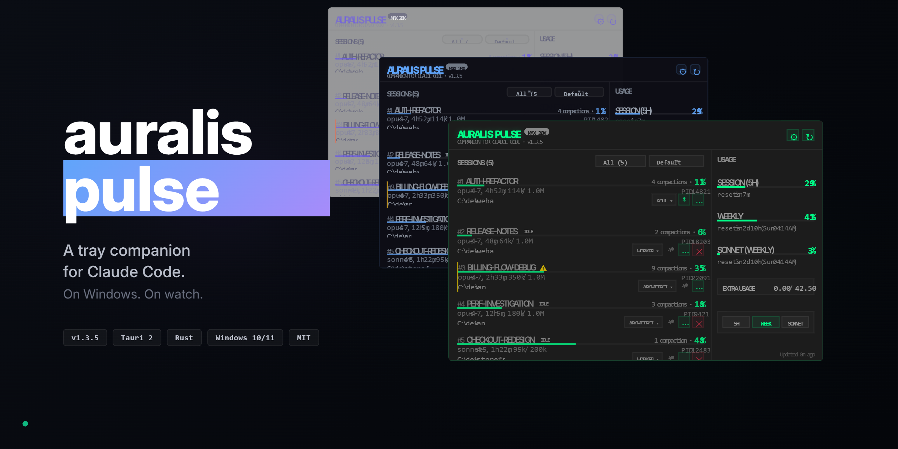

<!--
  README - v1.3.5+ rewrite
  Hero cover: docs/cover.png (1280x640, three-theme staircase + wordmark)
  No triptych section. Single hero carries the visual weight.
-->

<p align="center">
  
</p>

<h1 align="center">Auralis Pulse</h1>

<p align="center">
  <em>Threshold auto-fire and per-PID command delivery for every Claude Code session you run.</em>
</p>

<p align="center">
  <a href="https://github.com/antonpme/auralis-pulse/releases/latest">
    
  </a>
  <a href="https://v2.tauri.app/">
    
  </a>
  
  
  <a href="LICENSE">
    
  </a>
  
</p>

<p align="center">
  <a href="#why-pulse">Why</a> &middot;
  <a href="#vs-the-rest">vs. the rest</a> &middot;
  <a href="#install">Install</a> &middot;
  <a href="#features">Features</a> &middot;
  <a href="#how-it-works">How it works</a> &middot;
  <a href="#roadmap">Roadmap</a>
</p>

---

> **TL;DR.** Lives in your tray. Watches every Claude Code session running on the box. Fires `/compact`, your custom Crystallize prompt, or any slash command into the exact session that needs it, before the context window crashes. Three themes. MIT.

<a id="why-pulse"></a>

## Why Pulse?

Most usage tools tell you what already happened. Pulse acts before it happens.

- **Tray-resident.** Always on, never in the way. Pin to the bottom-right corner of your work area.
- **Threshold auto-fire.** Wire `/compact` (or any prompt) to the 88% mark. 10-second cancel toast. Done.
- **Per-PID command delivery.** Sends keystrokes to the specific Claude Code terminal that owns the session. No focus stealing, no wrong-tab accidents.
- **Custom commands library.** Slash commands or multi-line natural language, anything your workflow needs.
- **Alert presets per session.** Worker / Architect / Soul roles each have their own ceilings.
- **Live everything.** Tokens, model, status, 5-hour and weekly burn, Sonnet quota.
- **MCP server inside.** Expose live session state, usage, presets, and command library to any MCP-aware agent. Other agents can ask "where am I in my context?" and get a real answer.

<a id="vs-the-rest"></a>

## vs. the rest

The Claude Code tooling space is mostly read-only telemetry. Pulse is the only one that closes the loop and **actually sends commands when thresholds hit**.

| Tool | Form | Platforms | Live | Per-session | Auto-fire | Send | MCP |
|---|---|---|:-:|:-:|:-:|:-:|:-:|
| **Auralis Pulse** | Tray (Tauri 2) | Windows | ✅ | ✅ | ✅ | ✅ | ✅ |
| [ccusage](https://github.com/ryoppippi/ccusage) | CLI | All | ❌ snapshot | ✅ report | ❌ | ❌ | ❌ |
| [Claude-Code-Usage-Monitor](https://github.com/Maciek-roboblog/Claude-Code-Usage-Monitor) | TUI | All | ✅ | ✅ 5h | ❌ | ❌ | ❌ |
| [claudia](https://github.com/getAsterisk/claudia) | GUI desktop | All | ✅ analytics | ✅ history | ❌ | ❌ | ❌ |
| [ClaudeBar](https://github.com/tddworks/ClaudeBar) | Menu bar | macOS | ✅ | partial | ❌ | ❌ | ❌ |
| Built-in `/cost`, `/context` | Slash | In-session | on demand | current only | n/a | n/a | ❌ |

**Where Pulse loses, honestly.** Windows-only today (mac + Linux are on the v1.5 roadmap). No retrospective analytics or charts (use ccusage for that). Smaller star count: we just shipped.

**Where Pulse wins.** Auto-fire commands at thresholds. Per-PID precision. Custom multi-line message injection. An MCP server other agents can read from. Tray-native on Windows, the gap nobody else fills.

<a id="install"></a>

## Install

**Windows 10 / 11**

1. Grab `Auralis Pulse_X.Y.Z_x64-setup.exe` from [Releases](https://github.com/antonpme/auralis-pulse/releases/latest)
2. Run it. Per-user install, no admin needed.
3. Open from Start Menu. Tray icon appears.

That's it.

<details>
<summary><b>Permission forwarding hook (recommended)</b></summary>

When Claude Code asks for permission (Bash, Write, Edit), Pulse can catch it and let you approve from the tray with `Y` allow / `A` always / `N` deny. Add this to `~/.claude/settings.json`:

```json
{
  "hooks": {
    "PermissionRequest": [
      { "hooks": [{ "type": "command", "command": "node ~/.claude/hooks/permission-forward.js" }] }
    ]
  }
}
```

The hook script lives under `hooks/` in this repo. Copy it to `~/.claude/hooks/permission-forward.js`.

</details>

<details>
<summary><b>Build from source</b></summary>

Prereqs: [Rust 1.83+](https://rustup.rs/), [Node.js 18+](https://nodejs.org/), [Tauri 2 prerequisites](https://v2.tauri.app/start/prerequisites/).

```bash
git clone https://github.com/antonpme/auralis-pulse.git
cd auralis-pulse
npm install
npm run tauri build
```

Installer lands at `src-tauri/target/release/bundle/nsis/`.

</details>

<details>
<summary><b>Autostart with Windows</b></summary>

Open Settings (gear icon, top-right of the Pulse window) and toggle "Start with Windows". Stored as a per-user LaunchAgent.

</details>

<a id="features"></a>

## Features

### Per-PID command delivery

Send `/compact`, a custom Crystallize prompt, or any slash command into the exact session you target. Works across multiple Windows Terminal tabs. Doesn't steal focus. Doesn't disturb your other Claude Code instances.

Under the hood: `AttachConsole(pid)` plus `WriteConsoleInputW` direct to the target's console input buffer, with bracketed paste mode and a two-phase write for clean multi-line submission. Falls back to `SendKeys` for elevated processes.

See the [deep dive](#how-it-works) for the full mechanic.

### Active preset chip

Every session card shows the assigned preset (Default / Worker / Architect / Soul / your custom). Click the chip, swap the preset in a centered modal. Settings live by `session_id`, so a long-lived session keeps its config across Pulse restarts.

### Auto-fire on thresholds

Each preset has up to three tiers (warning / pre-critical / critical), and each tier carries:

- a token threshold (absolute number or %)
- desktop notification on/off
- a command to send (or none)

When a session crosses a tier, Pulse pops a 10-second countdown toast with a Cancel button. If you don't cancel, the command fires. Hysteresis prevents oscillation re-fires after compaction.

> **Real example.** Wire `/compact` to the 88% pre-critical tier on the Worker preset. When the session fills, Pulse fires it automatically. You stay in flow.

### Custom commands library

Build a library of commands once, use them across sessions. Each command carries:

- a name
- the slash command or natural language text
- single-line or multi-line (multi-line goes through clipboard paste, no SendKeys size limit)
- optional confirm prompt before sending

`Compact` ships seeded as a built-in.

### Live usage everything

- **5-hour window.** Burn rate, % used, reset countdown.
- **Weekly window.** Same metrics, longer horizon.
- **Sonnet quota.** Tracked separately from Opus.
- All cached on disk, exponential backoff (5 → 10 → 20 → 40 → 60 min) on rate limits.
- Stale-but-cached shows on boot. Never blocks the UI.

### Session list essentials

- **Color-coded fill levels.** Cards shift accent as context approaches the limit. Spot the hot one without reading numbers.
- **Filter** by status (active / idle / ghost) or by project root.
- **Sort** by context %, duration, last activity, or alphabetical. State persists.
- **Pin** important sessions to the top with the pushpin icon. Pinned cards stay visible even when filters hide everything else.
- **Ghost detection.** Sessions idle for 15 min flag IDLE. Orphaned sessions (60 min low context) flag GHOST. Dismiss individually.
- **Numbered cards** (#1, #2, #3) so you can reference them quickly when chatting with a teammate or filing an issue.

### Three themes

| Cyberpunk | Glassmorphism | Light |
|:--|:--|:--|
| neon green, sharp, terminal vibes | translucent dark, blue accents, airy | white, purple accent, editorial |

All theming token-based: change one CSS variable, the whole UI follows.

### Pin to corner

Bottom-right of the work area. DWM-aware: handles the invisible 5-8 px shadow margin that Win11 borderless windows carry, so the visible edge actually touches the screen corner. Same code path on first build and on every tray show.

### Auto-compact safety

Per-session opt-in checkbox. Even if a preset fires `/compact`, it's blocked unless you explicitly allowed it for that session. Defense in depth for long-running agents you don't want auto-compacting on you.

### MCP server inside

Pulse runs a Streamable HTTP MCP server on `127.0.0.1:59429`. Any MCP-aware agent (Claude Code, Cursor, Continue, Zed, Claude Desktop via `mcp-remote`) can read live Pulse state and drive it.

**Wire it into Claude Code in one command.** Open Settings -> MCP inside Pulse and copy the prefilled `claude mcp add` command (token already inlined), or build it yourself with the URL + token from `%LOCALAPPDATA%\auralis-pulse\mcp.json`:

```bash
claude mcp add --transport http --scope user auralis-pulse http://127.0.0.1:59429/mcp \
  --header "Authorization: Bearer <TOKEN>"
```

**Connect from other MCP clients.** Same server, different config files. Grab the token from Pulse's Settings -> MCP tab (Reveal + Copy) or from `%LOCALAPPDATA%\auralis-pulse\mcp.json`, then paste it into the snippet for your client.

<details>
<summary><b>Cursor</b></summary>

**Config file:** `<project>\.cursor\mcp.json` (per-project) or `%USERPROFILE%\.cursor\mcp.json` (global).

```json
{
  "mcpServers": {
    "auralis-pulse": {
      "url": "http://127.0.0.1:59429/mcp",
      "headers": {
        "Authorization": "Bearer <TOKEN>"
      }
    }
  }
}
```

**Restart Cursor** after editing (or Command Palette -> `Developer: Reload Window`). Cursor does not hot-reload `mcp.json`.

**Verify.** Cursor Settings -> Tools & MCP. The `auralis-pulse` entry shows a green dot and the tool list expanded.

**Tip.** You can substitute `"Authorization": "Bearer ${env:AURALIS_PULSE_TOKEN}"` and set the env var instead of inlining the token.

</details>

<details>
<summary><b>Continue.dev</b></summary>

**Config file:** `%USERPROFILE%\.continue\config.yaml`.

```yaml
mcpServers:
  - name: auralis-pulse
    type: streamable-http
    url: http://127.0.0.1:59429/mcp
    requestOptions:
      headers:
        Authorization: Bearer <TOKEN>
```

**No restart needed.** Continue hot-reloads `config.yaml` on save. If the server doesn't appear, reload the Continue panel or the IDE window.

**Verify.** Open the Continue panel, MCP servers section. `auralis-pulse` shows "Connected" with tools listed.

**Gotcha.** The `type: streamable-http` value is load-bearing. Omit it and Continue falls back to stdio with a cryptic error. The pre-1.0 `experimental.modelContextProtocolServers` schema in `config.json` is deprecated; use the YAML shape above.

</details>

<details>
<summary><b>Zed</b></summary>

**Config file:** `%APPDATA%\Zed\settings.json` (resolves to `C:\Users\<user>\AppData\Roaming\Zed\settings.json`).

```json
{
  "context_servers": {
    "auralis-pulse": {
      "url": "http://127.0.0.1:59429/mcp",
      "headers": {
        "Authorization": "Bearer <TOKEN>"
      }
    }
  }
}
```

**No restart needed.** Zed hot-reloads `settings.json`. Exception: if `settings.json` is a symlink, the file watcher misses changes; run Command Palette -> `workspace: reload` to pick up edits manually.

**Verify.** Open the Agent Panel, settings (gear icon). `auralis-pulse` shows with a green indicator.

**Gotcha.** The setting key is `context_servers`, not `mcpServers`. Easy to mistype if you are coming from Cursor or Claude Code.

</details>

<details>
<summary><b>Claude Desktop (via mcp-remote bridge)</b></summary>

Claude Desktop's `claude_desktop_config.json` still supports stdio transport only as of 2026. Its native "Custom Connectors" UI talks remote MCP but requires OAuth, which Pulse does not advertise. So we go through the [`mcp-remote`](https://github.com/geelen/mcp-remote) bridge.

**Prerequisite:** Node.js on `PATH` so `npx` resolves. Install from [nodejs.org](https://nodejs.org/) if missing.

**Config file:** `%APPDATA%\Claude\claude_desktop_config.json`.

```json
{
  "mcpServers": {
    "auralis-pulse": {
      "command": "npx",
      "args": [
        "-y",
        "mcp-remote",
        "http://127.0.0.1:59429/mcp",
        "--transport",
        "http-only",
        "--allow-http",
        "--header",
        "Authorization:Bearer ${AURALIS_PULSE_TOKEN}"
      ],
      "env": {
        "AURALIS_PULSE_TOKEN": "<TOKEN>"
      }
    }
  }
}
```

**Fully restart Claude Desktop** after editing (tray icon -> Quit, not just close window).

**Verify.** Claude Desktop -> Settings -> Developer -> MCP Servers. `auralis-pulse` shows "running". In a chat, the tools list (hammer icon) lists the ten Pulse tools.

**Gotchas.**
- `--allow-http` is mandatory for the `http://127.0.0.1` URL. Without it, `mcp-remote` rejects non-HTTPS targets and the connection silently fails.
- `--transport http-only` locks the bridge to Streamable HTTP. The default `http-first` falls back to SSE on probe failures, which Pulse does not serve.
- The `Authorization:Bearer ${TOKEN}` value uses no space after `:` on purpose. Windows argv mangles header strings with embedded spaces; HTTP parsers tolerate the missing space.
- If Claude Desktop ignores the file, enable Settings -> Developer Mode and restart again.

</details>

**Quick sanity check.** Once wired, ask the client to call `pulse_ping`. The expected response is `"pong (auralis-pulse v1.4.5)"`. If you see the version string, MCP transport and bearer auth are both healthy.

**Tools available today (v1.4.5):**

*Read:*

| Tool | Returns |
|---|---|
| `pulse_ping` | `pong` plus Pulse version. Health check. |
| `pulse_list_sessions` | Every alive Claude Code session: PID, session_id, cwd, name, started_at, duration_mins, last_activity_mins, status (active/idle/ghost). |
| `pulse_get_session(session_id)` | Full details for one session. Errors if no alive session matches. |
| `pulse_get_usage` | Current Anthropic OAuth usage: 5h window, weekly, Sonnet quota, extra usage credits. |
| `pulse_list_presets` | All alert presets, built-ins plus your custom ones, with thresholds and assigned commands. |
| `pulse_list_commands` | The custom command library. Slash commands and natural-language messages alike. |

*Write:*

| Tool | Effect |
|---|---|
| `pulse_send_command(pid, text)` | Inject text into a specific Claude Code session's terminal via the standard per-PID delivery path (`AttachConsole` + `WriteConsoleInputW`, `SendKeys` fallback). |
| `pulse_assign_preset(session_id, preset_id)` | Reassign a session's alert preset. Validates the preset_id against the live library; unknown ids error out. Frontend syncs within ~100ms via a Tauri event. |
| `pulse_refresh_usage` | Force an immediate Anthropic OAuth refresh, bypass the periodic loop. Returns the fresh usage state. |
| `pulse_clear_usage_cache` | Wipe disk cache + clear in-memory mirror. Pulse refetches on next tick. |

Bearer-token auth, localhost-only by design. The MCP tab inside Settings (v1.4.3) shows port, masked token, and a copy-button for the full `claude mcp add` command. Server-pushed notifications (`threshold-crossed`, `session-added`, `session-removed`, `usage-updated`) landed in v1.4.4 so connected clients react instantly without polling. Per-client setup snippets (v1.4.5) for Cursor, Continue, Zed, and Claude Desktop via `mcp-remote` are in the collapsible blocks above.

<a id="how-it-works"></a>

## How it works

Three subsystems.

**Renderer.** Reads `~/.claude/sessions/` and JSONL transcripts from `~/.claude/projects/`. Refreshes locally every 30 seconds, free, no API calls. Process-name verification prevents PID-reuse false positives when sessions die and Windows recycles their PIDs.

**Per-PID command delivery.** Bypasses focus and targets the right terminal even when you have multiple Claude Code tabs in Windows Terminal. Deep-dive below.

**Anthropic API.** OAuth usage call every 5 minutes. Disk cache at `%LOCALAPPDATA%\auralis-pulse\usage-cache.json`. Exponential backoff on 429.

<details>
<summary><b>Per-PID command delivery: the technical bit</b></summary>

Sending text to a specific terminal process on Windows is harder than it sounds. `SendKeys` requires window focus, which doesn't survive when you have multiple Claude Code tabs open in Windows Terminal. `SwitchToThisWindow` can't reliably select a specific tab inside WT.

Pulse uses `AttachConsole(pid)` plus `WriteConsoleInputW` to write directly to the target process's console input buffer:

- Bypasses window focus completely
- Works regardless of which tab is active in Windows Terminal
- Handles ConPTY pseudo-consoles correctly (where SendKeys synthetic input is filtered out)
- Per-PID precision: other sessions stay untouched
- Bracketed paste mode (`ESC[200~ ... ESC[201~`) for multi-line text
- Two-phase write with 250 ms delay so multi-line submits cleanly through ink/React TUI input handlers
- Auto-clear (Ctrl+U) before paste prevents accumulated leftover input from previous attempts
- `SendKeys` plus `SwitchToThisWindow` as a fallback if the console attach fails (rare; happens with elevated processes)

Same path runs for `/compact`, for any custom command you define, and for auto-fired threshold commands.

</details>

<details>
<summary><b>Window pinning on Windows 11</b></summary>

Borderless windows on Win11 carry an invisible DWM drop-shadow margin baked into `GetWindowRect`. Naively pinning to the work-area corner using the outer rect leaves a 5-8 px gap between the visible edge and the screen corner.

Pulse queries `DWMWA_EXTENDED_FRAME_BOUNDS` to get the visual rect, computes the shadow margin, then calls `SetWindowPos` with the offset so visible edges land exactly on the work-area corner. Same code path on first build and on every tray show.

</details>

<a id="roadmap"></a>

## Roadmap

- [x] **v1.3** Custom commands, alert presets, per-PID delivery, auto-compact safety, pin sessions, DWM-aware window pinning, preset chip, modal picker, DOM split for overlay isolation. v1.3.6 bugfix: Anthropic usage API resilience (nullable `resets_at`, refresh error toast, clear-cache button)
- **v1.4** ongoing through v1.4.5:
  - [x] **v1.4.0** Autostart preference persistence + diagnostic file logger (`pulse.log`) + MCP server foundation (Phase 1)
  - [x] **v1.4.1** MCP Phase 2: five read tools (`pulse_list_sessions`, `pulse_get_session`, `pulse_get_usage`, `pulse_list_presets`, `pulse_list_commands`) + JS↔Rust state mirror
  - [x] **v1.4.2** MCP Phase 3: four write tools — `pulse_send_command(pid, text)` injects a slash command or natural-language message into a specific Claude Code session, `pulse_assign_preset(session_id, preset_id)` swaps a session's alert ceiling (round-trips through the frontend so localStorage stays consistent), `pulse_refresh_usage` forces an Anthropic OAuth fetch, `pulse_clear_usage_cache` nukes the disk cache. Closes the loop: agents can now act on Pulse, not just read from it.
  - [x] **v1.4.3** MCP Phase 5: new MCP tab inside Settings — shows port, URL, masked token (with Reveal/Hide), one-click copy for the bearer token and the full `claude mcp add` command, plus a summary of exposed tools. No more digging through `mcp.json` to wire a client.
  - [x] **v1.4.4** MCP Phase 4: server-pushed notifications over the MCP `notifications/message` channel. Pulse broadcasts four event kinds with structured `{ kind, payload }` data: `threshold-crossed` (per-preset, fired by the frontend hysteresis loop, carries `session_id`/`pid`/`tier`/`used_tokens`/`limit_tokens`/`preset_name`), `session-added` and `session-removed` (diffed every 30s in the backend session refresh loop), `usage-updated` (after every successful Anthropic OAuth fetch, slim payload with `five_hour_pct`/`weekly_pct`/`sonnet_pct`). Server-side `Peer<RoleServer>` capture in `on_initialized`, transport-closed peers dropped on every broadcast. Connected clients get instant reactions, no polling.
  - [x] **v1.4.5** MCP Phase 6: per-client setup docs. Copy-paste config snippets for Cursor (`.cursor/mcp.json`), Continue (`config.yaml`), Zed (`settings.json`), Claude Desktop (via `mcp-remote` bridge), plus a single `pulse_ping` sanity check shared across all four. Documentation-only; no runtime changes.
- [ ] **v1.5** Cross-platform: macOS (.dmg) via iTerm2 Python API, Linux (.AppImage / .deb) with tmux send-keys, GitHub Actions CI matrix, optional auto-update
- [ ] **Future** Configurable keyboard shortcuts, session activity timeline, command chains (Crystallize, then wait, then Compact), Discord callback integration, Tailscale plus PWA for remote mobile access, plugin system

Full plan: [ROADMAP.md](ROADMAP.md)

## Contributing

Issues and PRs welcome. Pulse started as a personal tool and grew. If you use Claude Code heavily on Windows, the per-PID delivery and threshold auto-fire might be worth keeping around.

## License

[MIT](LICENSE) © 2026
